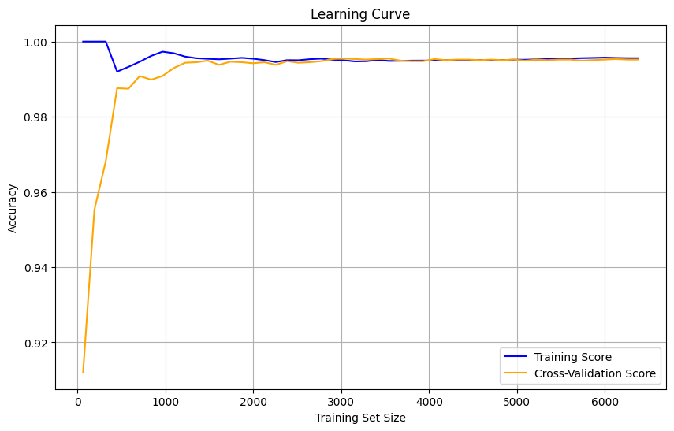

# Parameter Optimization of SVM

This project predicts room occupancy based on sensor data using a Support Vector Machine (SVM). The dataset contains features such as light, temperature, humidity, and CO2 levels, which help estimate the number of people in a room.

---

## **Table of Contents**
1. [Introduction](#introduction)
2. [Dataset](#dataset)
3. [Model](#model)
4. [Results](#results)
5. [Visualization](#visualization)
6. [How to Run](#how-to-run)

---

## **Introduction**

Room occupancy estimation is crucial for energy-efficient building management systems. In this project:
- The data is processed and visualized using Python libraries.
- Multiple SVM kernels (linear, poly, rbf, sigmoid) are evaluated for their performance.
- Learning curves are plotted to demonstrate the model's training and cross-validation performance.

---

## **Dataset**

The dataset used for this project is `Room_Occupancy_Data.csv`. It includes:
- Sensor readings (e.g., temperature, humidity, light, CO2).
- Target variable: Room Occupancy Count (number of people in the room).

The dataset undergoes preprocessing, including:
- Removal of unnecessary columns (e.g., date, time).
- Standardization of features using `StandardScaler`.

---

## **Model**

The Support Vector Machine (SVM) is used as the classification model. The script performs:
1. **Hyperparameter tuning**: Evaluates different values of `C`, `gamma`, and kernels.
2. **Learning Curve Analysis**: Assesses model performance as training size increases.

### **Optimization Process**
- 10 samples of train-test splits.
- Best kernel, `C`, and `gamma` parameters are identified based on accuracy.

---

## **Results**

### **Best Kernel and Parameters**
- Best Kernel: Linear
- Best Accuracy: 1.0
- Optimal Parameters:
  - Nu (C): 1.19
  - Epsilon (Gamma): 4.05

### **Performance Table**

| Sample | Best Accuracy | Best Kernel | Best Nu (C) | Best Epsilon (Gamma) |
|--------|---------------|-------------|-------------|-----------------------|
| 1      | 0.99          | linear      | 8.28        | 2.83                 |
| 2      | 0.99          | linear      | 0.61        | 6.43                 |
| 3      | 1.0           | linear      | 1.19        | 4.05                 |
| 4      | 0.99          | poly        | 6.94        | 4.37                 |
| 5      | 0.99          | poly        | 5.94        | 8.56                 |
| 6      | 1.0           | linear      | 0.74        | 3.55                 |
| 7      | 0.99          | linear      | 1.2         | 6.87                 |
| 8      | 0.99          | linear      | 7.75        | 2.21                 |
| 9      | 0.99          | poly        | 3.65        | 6.32                 |
| 10     | 0.99          | linear      | 8.55        | 9.98                 |

---

## **Visualization**

### **Learning Curve**
Below is the plot showing the training and validation accuracy for different training sizes:

 

---

## **How to Run**

1. Clone this repository:
   ```bash
   git clone https://github.com/sidharthd7/Parameter-Optimization-SVM.git
   cd Parameter-Optimization-SVM
   ```

2. Install the required packages:
   ```bash
   pip install -r requirements.txt
   ```

3. Add your dataset (`Room_Occupancy_Data.csv`) to the project folder.

4. Run the Jupyter Notebook

---